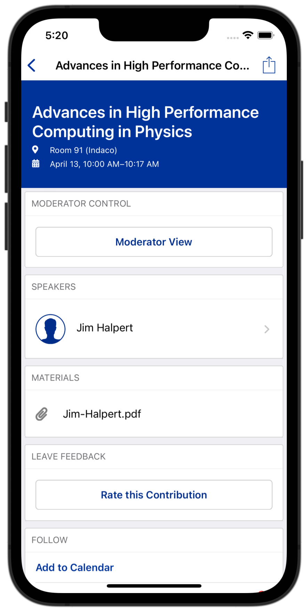
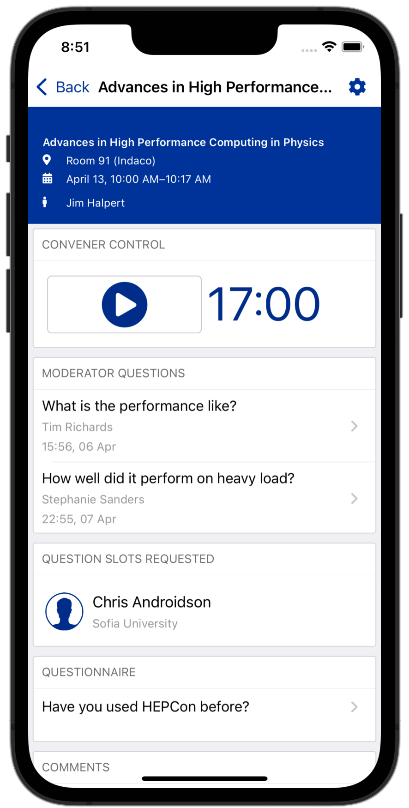
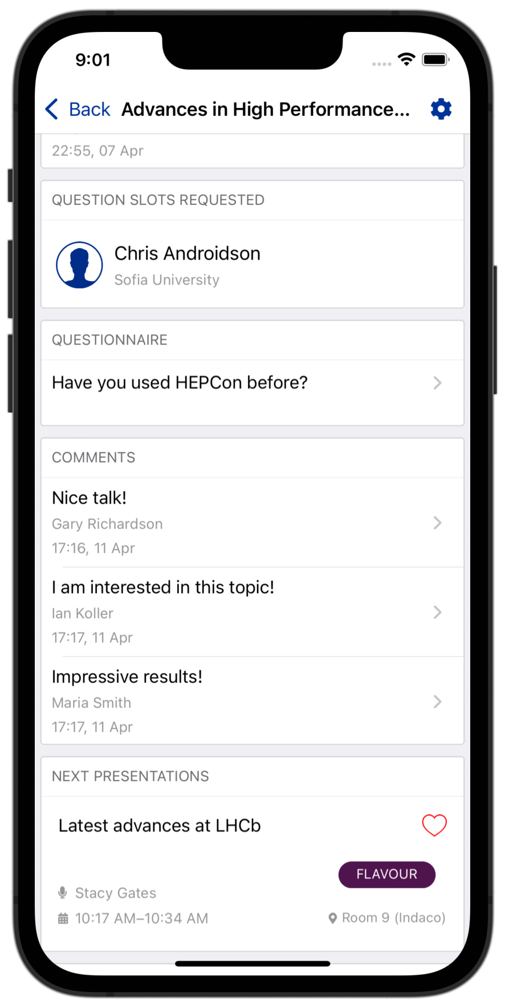
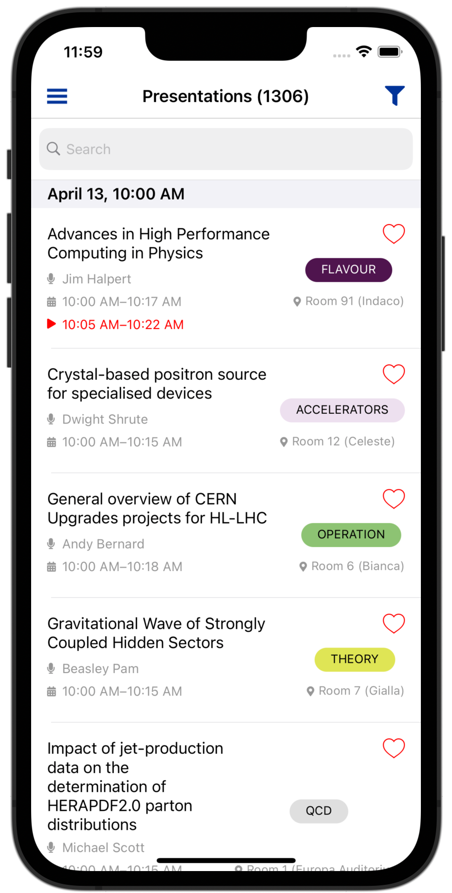
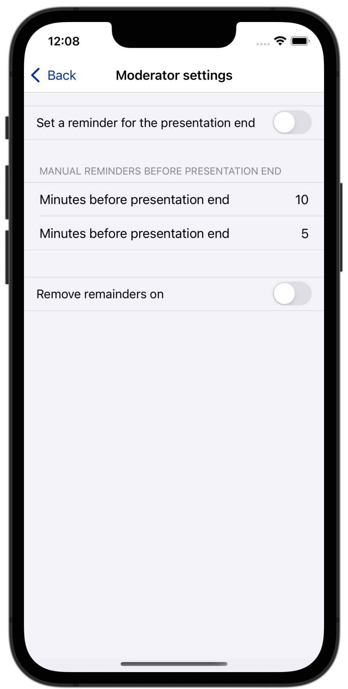

Moderator's perspective
=====

Moderators (conveners) are users with special access level. You simply need to register and sign in with your Indico convener email.
Once logged in you would gain access to special features.
You have to go to the details of a presentation and if you had signed in with your convener email,
then a special "Moderator View" button will appear in the "Moderator Control" card.

Navigating in "Moderator View" is going to open another page like the following:

Standart information
--------------------

The standart information like title, start/end time, speaker, location.

Moderator control
-----------------
It is not unusual when a presentation actually starts with a delay or ahead of schedule.
When attendees are interested in such a presentation chanses are they might not join the desired presentation on time
because they would not know when it actually started.

Moderator Control is the place where a moderator could start and end a presentation dynamically so the attendees would know the actual start time.
Presentations with dynamically overriden schedule are presented to the attendees like in the following screenshot.

It is in the todo list for them to receive push notifications if they had favorited a presentation which schedule is altered.

Moderator settings
------------------
There is the Moderator settings page available by clicking the gear icon in the top right corner when in Moderator View mode.
There are options for a moderator to set reminders when the presentation is supposed to end
and two more additional reminders when certain amount of the presentation is passed.

Moderator questions
-----------------

The third section in the Moderator View is related to asking questions to the speaker.
HEPCon provides this functionality to increase the amount of time dedicated for questions by minimizing the efforts for handing over microphones, etc.
This section would contain all the questions the attendees had sent while participating in the presentation and is up to the moderator to ask them.

Questions slots requested
-------------------------

This sections includes attendees that had request for asking questions themselves.
They would appear in a list in order based on the time they have places the request.

It is in the TODO list to mark whether they have a question or a comment.

Questionnaire
-------------

The questionnaire section contains questionnaires the speakers had previously initiated.
This section would be beneficial if the questionnaires affects important parts of the presentation at the time it is being presented.

Next presentation
-----------------

Section containing which is the next presentation.

Previous presentation
---------------------

Section containing which is the previous presentation.