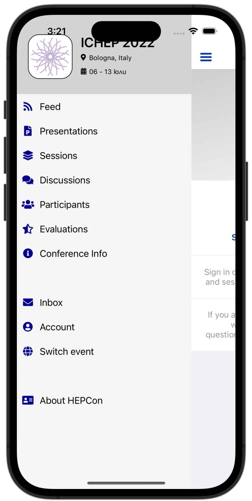

Usage
=====

Almost all of the HEPCon specific functionality requires an active account.
The process of registering and logging in is very simple.
Navigate to the Account page and click on the Create Account button.

.. image:: https://hepcon.app/assets/img/screenshots/account.png
   :width: 150px
   :alt: sign up page
   :align: right

| The three text boxes - email, public name and password are required. The public name field will be shown when you post comments, etc instead of your email.

| .. image:: https://hepcon.app/assets/img/screenshots/signup.png
   :width: 100px
   :alt: sign in page
   :align: right

| From organizer's perspective
------------

From convener's perspective
------------

From speaker's perspective
------------

From attendee's perspective
------------
