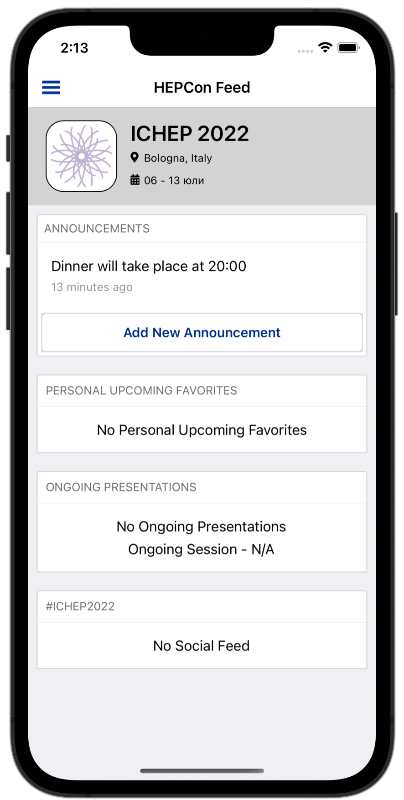
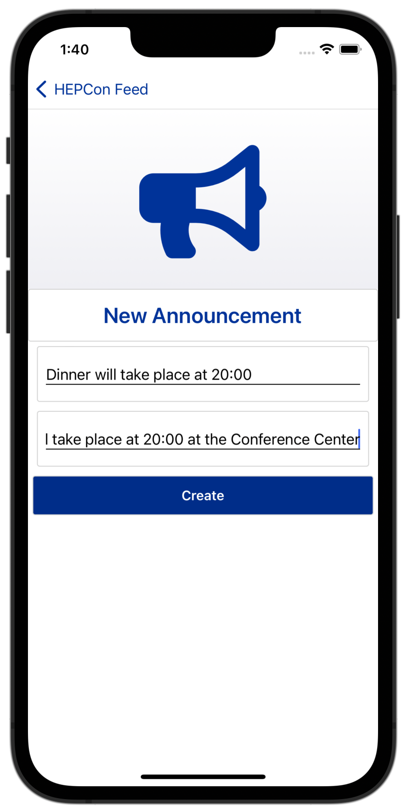

Usage
=====

Almost all of the HEPCon specific functionality requires an active account.
The process of registering and logging in is very simple.
Navigate to the Account page and click on the Create Account button.

.. image:: _static/menu.png
   :width: 200px
   :alt: main menu

.. image:: https://hepcon.app/assets/img/screenshots/account.png
   :width: 200px
   :alt: sign up page

.. image:: https://hepcon.app/assets/img/screenshots/signup.png
   :width: 200px
   :alt: sign in page

The three text boxes - email, public name and password are required. The public name field will be shown when you post comments and others, instead of your email.
After signing up you will receive an email containing a confirmation link. Once you click on it your account is activated and ready to be used.

Then you navigate to the Sign In page and log in.

From organizer's perspective
------------
Organizers are users with special access level. They can:
1. Issue new announcements

You can notice the button "Add New Announcement" is available only in this mode.

From convener's perspective
------------

From speaker's perspective
------------

From attendee's perspective
------------
